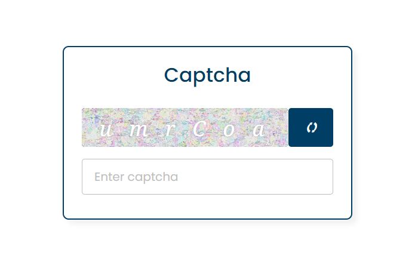

# Captcha Trial for jsPsych

This Captcha Trial is a customizable, fully working captcha system built on top of [jsPsych](https://www.jspsych.org/), a JavaScript library for creating behavioral experiments that run in a web browser. 

The Captcha Trial injects an HTML captcha form and checks the user's input against the generated captcha. On success, it completes the jsPsych trial with a `success: true` flag and the user's input. If the captcha is not correctly entered, the user is prompted to try again.

## Prerequisites

Before you begin, ensure you have met the following requirements:

* You have installed jsPsych. If not, you can check their [Getting Started Guide](https://www.jspsych.org/overview/running-experiments/).
* You have a basic knowledge of JavaScript and jsPsych.

## Usage

To use the Captcha Trial, follow these steps:

1. Import the `captchaTrial` into your jsPsych experiment. You may do this by copy-pasting the code into your experiment's JavaScript file, or by importing it from a separate file.
2. Add the `captchaTrial` to the timeline of your experiment like any other jsPsych trial.

## Detailed Code Explanation

This is an object that represents a single jsPsych trial, with several key-value pairs that define its behavior.

The `type` property specifies the jsPsych plugin that should be used to run the trial.

The `stimulus` function returns the HTML for the captcha form.

The `on_load` function is called when the HTML document is fully loaded. This function adds CSS rules, handles the generation of a new captcha when the page is loaded or the refresh button is clicked, and manages the verification of the captcha when the check button is clicked.

The `on_finish` function is called when the trial is complete. It removes the injected CSS rules from the head of the document.

Please note that the `on_finish` function expects the `data` argument to contain a `styleElement` property, which is a reference to the injected style element. This property is added to the `data` object in the `on_load` function.

For more information about creating custom jsPsych trials, please refer to the [jsPsych documentation](https://www.jspsych.org/).

## License

This project uses the following license: [MIT License](https://opensource.org/license/mit/).
